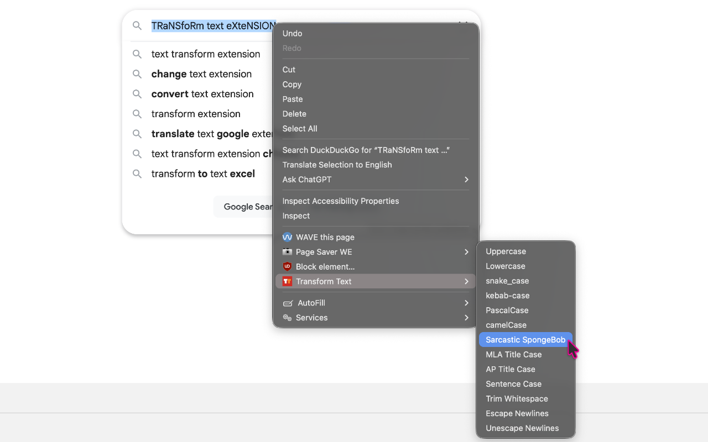

# Transform Text Extension

A Chromium extension that adds text transformation options to the context menu. Select any text in an editable field, right-click, and apply a transformation instantly.



[](https://chromewebstore.google.com/detail/transform-text/hniojnoepnkpmimpnbaljkkcmoaklcii)
[](https://microsoftedge.microsoft.com/addons/detail/transform-text/jmmaiegdlpmbochdbahokkbjelncaioc)

- **Author**: [Karl Horning](https://github.com/Karl-Horning)
- **Licence**: MIT

## Table of Contents

- [Tech Stack](#tech-stack)
- [Installation](#installation)
  - [From source](#from-source)
- [Scripts](#scripts)
- [Transformations](#transformations)
- [Limitations](#limitations)
- [Feedback and Issues](#feedback-and-issues)
- [Design](#design)

## Tech Stack

- **Language**: TypeScript
- **Build**: esbuild
- **Testing**: Vitest
- **Tooling**: ESLint, Prettier

[↑ Back to top](#transform-text-extension)

## Installation

### From source

```bash
git clone https://github.com/Karl-Horning/transform-text-extension.git
cd transform-text-extension
npm install
npm run build
```

Then load the extension in Chrome:

1. Go to `chrome://extensions`
2. Enable **Developer mode**
3. Click **Load unpacked** and select the project folder

[↑ Back to top](#transform-text-extension)

## Scripts

| Command                 | Description                            |
| ----------------------- | -------------------------------------- |
| `npm run build`         | Compile TypeScript to `dist/`          |
| `npm run build:zip`     | Build and package for store submission |
| `npm run test`          | Run all tests once                     |
| `npm run test:watch`    | Run tests in watch mode                |
| `npm run test:coverage` | Run tests with coverage                |

[↑ Back to top](#transform-text-extension)

## Transformations

- Escape / Unescape Newlines
- Uppercase / Lowercase
- snake_case, kebab-case, PascalCase, camelCase
- Sentence case, MLA Title Case, AP Title Case
- Sarcastic SpongeBob
- Trim Whitespace

[↑ Back to top](#transform-text-extension)

## Limitations

- Transformations only work in editable fields such as `<input>` and `<textarea>` elements — selected text in non-editable elements such as paragraphs and headings cannot be replaced
- Escape Newlines and Unescape Newlines may not work as expected in all contexts due to a Chrome limitation where `selectionText` strips newlines from selected text
- Text replacement and re-selection may not work in some complex web applications that manage their own editor state, such as Copilot and Gemini

[↑ Back to top](#transform-text-extension)

## Feedback and Issues

Found a bug or have a suggestion? [Open an issue](https://github.com/Karl-Horning/transform-text-extension/issues).

[↑ Back to top](#transform-text-extension)

## Design

Source icon files are in `design/icons/` and were created in [Affinity Designer](https://affinity.serif.com/en-gb/designer/).

Built with [Claude](https://claude.ai) as an AI pair programmer.

[↑ Back to top](#transform-text-extension)
